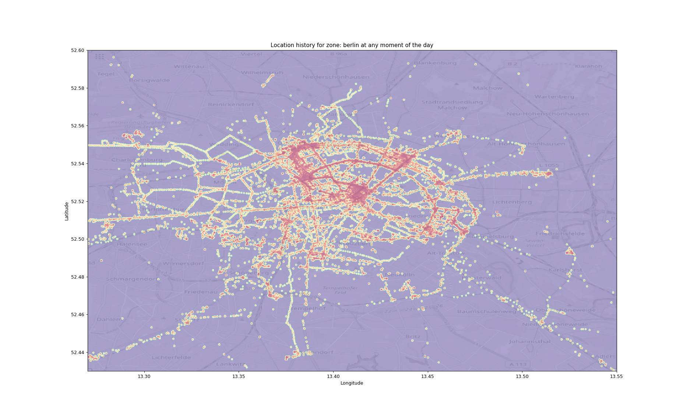

# Location to heatmap

This tool creates static and animated heatmaps of a given zone based on the data from Google location service.

It can be useful to find parts of a city that you never visited and visualize your movement and habits.

Click here to see the 

## Usage
You need to have the Google location service active for some time to collect the data. Use [Google Takeout](https://takeout.google.com/) to export the location history.

Then, choose a city or region you are interested in and produce a background map, for example taking a screenshot of Open Street Map.

Then, create a virtualenv, install the dependencies and run the script like this (example coordinates for Berlin, Germany):

    python3 -m venv .venv
    python3 -m pip install -r requirements.txt
    python3 process.py region_name 132700000 135500000 524300000 526000000 1500 /path/to/location/history/export.json /path/to/background/map/image.png

You can use `python3 process.py --help` to get a description, but in short the numbers you see are the decimal coordinates multiplied by 10^7, the zoom level (1000 = 1 pixel per 10 meters), the name to use for the title and the input files.

It will create a global heatmap and one for every 15 minutes span after midnight. These images are then merged in an animated GIF and a webm video using the amazing [MoviePy](http://zulko.github.io/moviepy/) library.

## License
MIT licensed, use as you wish.

Made with ❤️ with Python and open source libraries.
